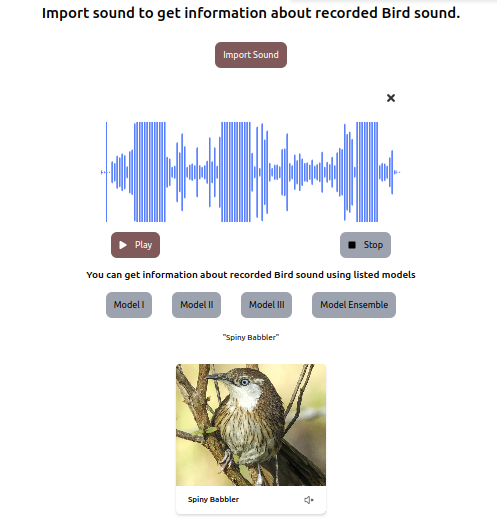

# Samrakshyan
संरक्षण: An Endangered Birds Recognition Portal

Home to around 11,000 species of fauna, Nepal is a country rich in biodiversity. Among them about 900 species are birds. Due to various reasons like encroachment of their natural habitats, and rampage killing many of these species are facing the threat of extinction. Around 38 endangered birds in Nepal need conservation. The growing advancement in machine learning can support the preservation of those species and monitoring the status of birds in the ecosystem can assist researchers of Nepal’s biodiversity in planning different strategies for their preservation. We developed an endangered bird classification system to identify bird calls from the audio data set collected from Xeno-canto.org. This was achieved by extracting the spectral characteristics of the audio signal through Mel-Spectrogram and MFCC (Mel-Frequency Cepstral Coefficients) which generated the spectrogram. It was fed into the deep learning model architecture like efficientNet which is based on a convolutional neural network. A genetic algorithm was used for hyper-parameter optimization. Our best results showed an F1-Score of 79\% for 41 species of birds. This has significant implications for the field of biodiversity conservation, as it allows researchers to monitor and protect threatened and endangered species.

# Output

## Home Page

## Prediction

## Bird Details

